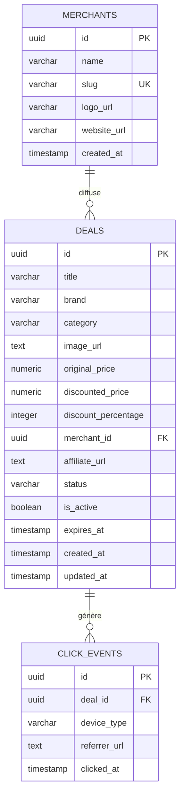

# Data Model: Tennis Deals Catalog

**Feature**: `001-tennis-deals-catalog`
**Date**: 2026-09-20
**Database**: PostgreSQL (Neon Serverless Free Tier)

---

## 1. Schema Overview & Entity Relationship



---

## 2. Table Specifications

### 2.1 Table `merchants`
Représente les enseignes marchandes partenaires diffusant des promotions sur les articles de tennis.

| Colonne | Type | Nullable | Valeur par défaut | Description & Contraintes |
|---|---|:---:|---|---|
| `id` | `UUID` | Non | `gen_random_uuid()` | Clé primaire unique |
| `name` | `VARCHAR(100)` | Non | - | Nom commercial de l'enseigne (ex: "Tennis-Point", "Extreme Tennis") |
| `slug` | `VARCHAR(100)` | Non | - | Identifiant textuel unique (ex: "tennis-point") |
| `logo_url` | `TEXT` | Oui | `NULL` | URL du logo de l'enseigne pour affichage sur la fiche |
| `website_url` | `TEXT` | Non | - | URL racine du site marchand |
| `created_at` | `TIMESTAMPTZ` | Non | `NOW()` | Horodatage de création |

### 2.2 Table `deals`
Représente chaque promotion individuelle sur un article de tennis.

| Colonne | Type | Nullable | Valeur par défaut | Description & Contraintes |
|---|---|:---:|---|---|
| `id` | `UUID` | Non | `gen_random_uuid()` | Clé primaire unique utilisée pour la redirection `/go/:id` |
| `title` | `VARCHAR(255)` | Non | - | Désignation de l'article (ex: "Babolat Pure Aero 2023 Non Cordée") |
| `brand` | `VARCHAR(100)` | Non | - | Marque du matériel (ex: "Babolat", "Wilson", "Head", "Nike") |
| `category` | `VARCHAR(50)` | Non | - | Catégorie : `'raquettes'`, `'cordages'`, `'chaussures'`, `'textile'`, `'accessoires'` |
| `image_url` | `TEXT` | Non | - | URL sécurisée (HTTPS) de la photo du produit |
| `original_price` | `NUMERIC(10, 2)` | Non | - | Prix de référence en Euros (prix barré, > 0) |
| `discounted_price` | `NUMERIC(10, 2)` | Non | - | Prix remisé en Euros (> 0 et <= `original_price`) |
| `discount_percentage` | `INTEGER` | Non | - | Taux de réduction entier : `ROUND(((original_price - discounted_price) / original_price) * 100)` |
| `merchant_id` | `UUID` | Non | - | Clé étrangère référençant `merchants(id)` |
| `affiliate_url` | `TEXT` | Non | - | URL cible finale contenant les paramètres d'affiliation du marchand |
| `status` | `VARCHAR(20)` | Non | `'active'` | Statut : `'active'`, `'expired'`, `'invalid'` |
| `is_active` | `BOOLEAN` | Non | `true` | Indicateur booléen d'activation rapide |
| `expires_at` | `TIMESTAMPTZ` | Oui | `NULL` | Date/heure limite de validité de l'offre (si communiquée) |
| `created_at` | `TIMESTAMPTZ` | Non | `NOW()` | Date d'ajout de la promotion dans le catalogue |
| `updated_at` | `TIMESTAMPTZ` | Non | `NOW()` | Horodatage de dernière actualisation |

#### Contraintes de validation
- `category_check`: `category IN ('raquettes', 'cordages', 'chaussures', 'textile', 'accessoires')`
- `status_check`: `status IN ('active', 'expired', 'invalid')`
- `price_validity`: `original_price > 0 AND discounted_price > 0 AND discounted_price <= original_price`
- `discount_check`: `discount_percentage >= 0 AND discount_percentage <= 100`

### 2.3 Table `click_events`
Journalise chaque activation de redirection interne à des fins de mesure de performance d'affiliation, sans stockage d'adresse IP ni données personnelles (conformité RGPD).

| Colonne | Type | Nullable | Valeur par défaut | Description & Contraintes |
|---|---|:---:|---|---|
| `id` | `UUID` | Non | `gen_random_uuid()` | Identifiant unique de l'événement de redirection |
| `deal_id` | `UUID` | Non | - | Clé étrangère référençant `deals(id)` (ON DELETE CASCADE) |
| `device_type` | `VARCHAR(20)` | Non | `'unknown'` | Type d'appareil : `'mobile'`, `'desktop'`, `'tablet'`, `'unknown'` |
| `referrer_url` | `TEXT` | Oui | `NULL` | URL ou chemin interne d'origine (ex: `/?category=raquettes`) |
| `clicked_at` | `TIMESTAMPTZ` | Non | `NOW()` | Horodatage UTC précis du clic |

---

## 3. Indexation & Performance

Afin de garantir des temps de réponse inférieurs à 150 ms avec plus de 500 offres actives et un tri instantané, les index suivants sont mis en place :

```sql
-- 1. Index d'exclusion et de filtrage des offres actives valides
CREATE INDEX idx_deals_active_status 
ON deals (status, is_active, expires_at);

-- 2. Index composites pour l'affichage par défaut (nouveautés en premier)
CREATE INDEX idx_deals_created_at_desc 
ON deals (created_at DESC) 
WHERE status = 'active' AND is_active = true;

-- 3. Index composite pour le tri par réduction
CREATE INDEX idx_deals_discount_desc 
ON deals (discount_percentage DESC) 
WHERE status = 'active' AND is_active = true;

-- 4. Index composites par catégorie
CREATE INDEX idx_deals_category_created 
ON deals (category, created_at DESC) 
WHERE status = 'active' AND is_active = true;

CREATE INDEX idx_deals_category_discount 
ON deals (category, discount_percentage DESC) 
WHERE status = 'active' AND is_active = true;

-- 5. Index Full-Text Search (recherche textuelle instantanée sur titre et marque)
CREATE INDEX idx_deals_fts 
ON deals USING GIN (to_tsvector('french', title || ' ' || brand));

-- 6. Index de suivi des clics
CREATE INDEX idx_click_events_deal_date 
ON click_events (deal_id, clicked_at DESC);
```

---

## 4. Sécurité & Modèle d'Accès

Dans l'architecture avec **Neon**, la base de données n'est jamais exposée directement au navigateur client :
1. **Isolation serveur stricte** : Next.js accède à Neon exclusivement depuis les composants serveurs (React Server Components) et les Route Handlers (`app/go/[dealId]/route.ts`) via la variable secrète `DATABASE_URL`. Aucune clé de base n'est injectée dans le bundle frontend.
2. **Filtrage automatique des offres** : Les fonctions d'interrogation du catalogue appliquent systématiquement la clause de garde stricte :
   ```sql
   WHERE status = 'active' 
     AND is_active = true 
     AND (expires_at IS NULL OR expires_at > NOW())
   ```
3. **Accès Workflows n8n** : n8n se connecte directement à Neon avec la chaîne de connexion sécurisée (SSL activé) pour effectuer les insertions et la purge cron horaire.

